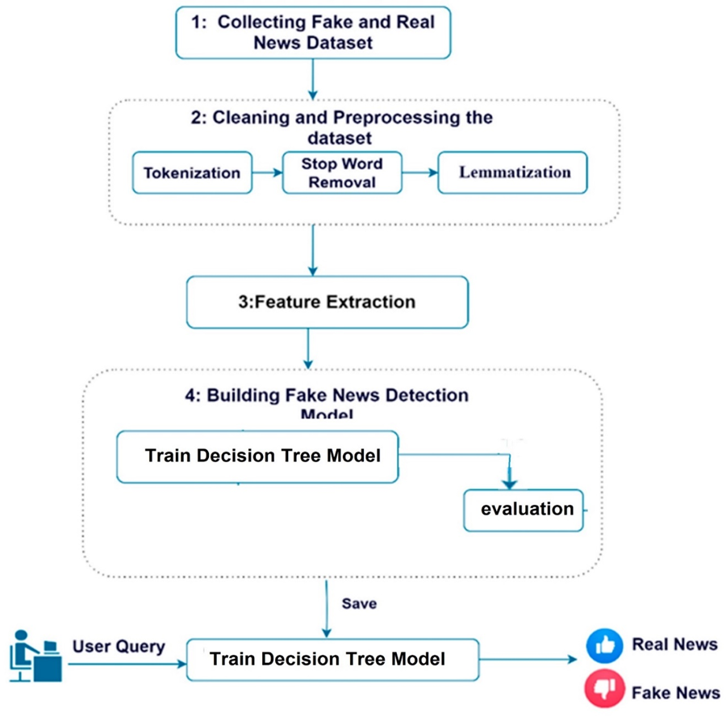

# fake-news-doc
---
## 1. Overview
The topic of fake news is as old as the news industry itself — misinformation, hoaxes, propaganda, and satire have long been in existence. So fake news is information that cannot be verified, without sources, and possibly untrue.

Wiki also said:” Fake news is written and published usually with the intent to mislead in order to damage an agency, entity, or person, and/or gain financially or politically, often using sensationalist, dishonest, or outright fabricated headlines to increase readership. Similarly, clickbait stories and headlines earn advertising revenue from this activity.”

## 2. Motivation
Fake news undermines serious media coverage and makes it more difficult for journalists to cover significant news stories. An analysis by BuzzFeed found that the top 20 fake news stories about the 2016 U.S. presidential election received more engagement on Facebook than the top 20 election stories from 19 major media outlets. Anonymously-hosted fake news websites lacking known publishers have also been criticized because they make it difficult to prosecute sources of fake news for libel.

In the 21st century, the impact of fake news became widespread! Over time, the Internet has grown to unimaginable heights with tons of information coming in all the time which allows the Internet to be a host for plenty of unwanted, untruthful and misleading information that can be made by anyone. Fake news has grown from being sent via emails to attacking social media. Besides referring to made-up stories designed to deceive readers into clicking on links, maximizing traffic and profit, the term has also referred to satirical news, whose purpose is not to mislead but rather to inform viewers and share humorous commentary about real news and the mainstream media. So the problem is great. Let’s try to detect fake news with a machine learning approach.

## 3. Success metrics
• Detection Accuracy: It represents the ability of the machine learning system to accurately identify fake news. It can be measured by calculating the percentage of correctly classified news articles that are recognized as fake by the system.

• Comprehensive Coverage: It represents the system's ability to detect a wide range of fake news and not miss any. It can be measured by comparing the number of detected fake news articles to the total number of fake news articles present in the training dataset.

• Time Efficiency: It represents the amount of time and resources required by the system to detect fake news. This metric aims to achieve high efficiency in the process to enable the system to be effectively used in real-time.
## 4. Requirements & Constraints
Functional Requirements:
1.	News Classification: The system should be able to classify news articles as either fake or real.
2.	Classification Accuracy: The system should achieve a high level of accuracy in classifying fake and real news.
3.	Real-time News Processing: The system should be capable of processing news articles in real time to provide quick responses.

Non-Functional Requirements:
1.	High Performance: The system should be able to handle a large volume of news articles in a short time and with a fast response rate.
2.	System Availability: The system should be continuously available and accessible to users. 
3.  High Accuracy and Consistency: The system should be accurate and consistent in its performance across a diverse range of fake news articles. 
4. Ease of Use: The system should be user-friendly and provide an intuitive user interface for users.
### 4.1 What's in-scope & out-of-scope?
Within the scope:
1.	Developing a machine learning model or algorithm for detecting fake news.
2.	Training the model using labeled datasets that contain both fake and real news.
3.	Feature engineering and selection to improve the model's performance.
4.	Evaluating and testing the model's accuracy, precision, recall, and other performance metrics.
5.	Creating a user interface or visualization components to display the results of fake news detection.

Outside the scope:
1.	Collecting and categorizing the training dataset. This task may require domain expertise and manual verification of news.
2.	Building a complete news platform or application from scratch.
3.	Dealing with legal and ethical implications of fake news detection, such as content censorship or concerns about freedom of expression.
4.	Handling news in languages other than English, as the project may focus on a specific language or set of languages.
5.	Dealing with other forms of media, such as images or videos, as the project specifically focuses on textual news.

## 5. Methodology

### 5.1. Problem statement

For the project of using machine learning to detect fake news, the problem can be framed as a supervised classification problem. The goal is to develop a model that can accurately classify news articles into two categories: fake news and real news.
The problem statement can be defined as follows: Given a dataset of labeled news articles, the task is to train a machine learning model that can learn patterns and features from the data to differentiate between fake and real news. The model should then be able to classify new, unseen news articles as either fake or real with a high level of accuracy.

### 5.2. Data

In a machine learning project for detecting fake news, training the model requires the use of a labeled dataset that contains previously classified news as fake and real. This dataset should be diverse and representative of different cases of fake and real news.
For my train data set, I would like to take the Kaggle competition open dataset. Let’s make a brief exploratory data analysis for it.

We have got the next columns:

•	id: unique id for a news article

•	title: the title of a news article

•	author: author of the news article

•	text: the text of the article; could be incomplete

•	label: a label that marks the article as potentially unreliable

1: unreliable

0: reliable

### 5.3. Techniques

• Using nltk for text handling and applying suitable techniques like stemming and stop-word removal.

• Utilizing Tfidf Vectorizer to transform texts into numerical arrays.

• Choosing a classification model such as Decision Tree Classifier for model training.

### 5.4. Experimentation & Validation

• Splitting the data into training and testing sets.

• Training the model on the training data.

• Evaluating the model's performance on the testing data.

• Using accuracy score to measure the model's accuracy.
### 5.5. Human-in-the-loop

Employing the Human-Machine approach

This approach is considered an innovative method in developing models for detecting fake news. It involves using machine learning in conjunction with collective human efforts to achieve better results in identifying fake news. This approach is particularly effective in the field of detecting fake news propagated by social bots.

## 6. Implementation

### 6.1. High-level design

### 6.2. Infra

This system will be published on the cloud as a web application
### 6.3. Performance (Throughput, Latency)

In terms of system scalability, our model will be implemented to be vertically and horizontally scalable.

Vertical scalability: The system's capacity will be increased by upgrading current resources such as computational power, memory, and storage. This means that performance can be enhanced by scaling up the current system infrastructure.

Horizontal scalability: The system's capacity will be increased by adding additional components such as servers and central processing units (CPUs). Workload distribution, using load balancing, will be employed to distribute requests among these components, achieving load balancing and increasing system capacity.

### 6.4. Security

The system will be accessible to everyone without the need for a subscription. 

### 6.5. Data privacy

The system will not store the news inputted by the users,but only as requests. 

### 6.6. Monitoring & Alarms

All requests will be stored into the database to make some statistics that could be benefit later, and alarms will be on the maximum requests from the same ip to deny the Non-human requests 
### 6.7. Cost

Training requires a high-specification computer or server depending on the size of the dataset. However, in our case, the dataset is small, so a suitable personal computer is sufficient for the task.

It is possible to host the application on the internet, which would result in lower costs.

### 6.8. Integration points

Users can interact with the produced model through a simple interface.

### 6.9. Risks & Uncertainties

1-	Dealing with Change: A machine learning project tackling misinformation detection may face changes in the news environment and the deceptive techniques employed in producing misleading news. It is crucial to develop a model that can handle these changes and adapt to them through regular updates to improve its performance.

2-	Transparency and Interpretability: Machine learning and the classification of misleading news can sometimes be perceived as opaque and difficult to interpret. Understanding the reasons behind the model's classification decisions can be challenging. It is essential to review and clarify the model, documenting the algorithms used to enhance transparency and confidence in the results.

## 7. Appendix

### 7.1. Alternatives

Alternative 1: Manual News Classification

Advantages:

•	Human investigators can apply precise criteria to news articles and analyze texts in detail to determine if they are misleading or not.

•	Human work can be more flexible in dealing with changes in deceptive news production techniques.

Disadvantages:

•	Manual classification requires a lot of work and time, which may be impractical for processing large volumes of data.

•	It may be susceptible to psychological biases and human biases, which can result in lower accuracy compared to automated models.

Rationale behind the decision:

Manual news classification was excluded as an alternative due to practical challenges, time consumption, and potential human biases. Additionally, the machine learning project aims to develop a model capable of analyzing large volumes of data quickly and accurately, which can be better achieved through automated models.

### 7.2. Experiment Results

Share any results of offline experiments that you conducted.

### 7.3. Performance benchmarks

Utilizing the confusion matrix to evaluate the model's performance.

The following performance measures are used:

	Accuracy: Percent of correct classifications

	Precision: Percent of the total number of correctly classified positive classes divided by the total number of predicted positive classes. 

	Recall: Percent of the total number of correctly classified positive classes divide by the total number of positive classes. 

### 7.4. Milestones & Timeline

1-Data Collection and Cleaning (week 1-2):

•	Identify suitable data sources for training and validation.

•	Clean the data, removing duplicates and invalid entries.

2-Machine Learning Model Development (week 3-4):

•	Determine the appropriate architectural pattern for the machine learning model.

•	Prepare and partition the data2. Machine Learning Model Development (Month 3-5):

•	Determine the appropriate architectural pattern for the machine learning model.

•	Prepare and partition the data into training, validation, and test sets.

•	Train the model using the training data.

•	Fine-tune and optimize the model using the validation data.

3-Model Evaluation and Testing (week 2-3):

•	Evaluate the performance of the model using the validation and test data.

•	Measure the accuracy and response time of the model.

•	Make necessary adjustments to improve the model's performance.

4-User Interface Development (week 1-2):

•	Design and develop a simple user interface for the deceptive news detection system.

•	Implement features such as input for news articles, display of classification results, and user feedback.
### 7.5. Glossary

1.	Machine Learning (ML): A field of artificial intelligence that focuses on developing algorithms and models that enable computers to learn and make predictions or decisions without being explicitly programmed.
2.	Deceptive News: False or misleading information presented as news or factual reporting with the intention to deceive or manipulate readers.
3.	Data Collection: The process of gathering relevant data from various sources, such as news articles, websites, or social media platforms, to be used for training and evaluating the machine learning model.
4.	Data Cleaning: The process of removing or correcting errors, duplicates, inconsistencies, and irrelevant data from the collected dataset to ensure data quality and improve the performance of the machine learning model.
5.	Training Data: The subset of the dataset used to train the machine learning model. It consists of labeled examples where the deceptive or non-deceptive nature of the news articles is known.
6.	Validation Data: The subset of the dataset used to assess and fine-tune the performance of the machine learning model during the training phase. It helps in evaluating the model's generalization and making adjustments to improve its accuracy.
7.	Test Data: The subset of the dataset that is used to evaluate the final performance of the trained machine learning model. It provides an unbiased measure of the model's accuracy on unseen data.
8.	Model Evaluation: The process of assessing the performance of the trained machine learning model by comparing its predictions against the ground truth labels of the test data. Common evaluation metrics include accuracy, precision, recall, and F1 score.
9.	User Interface (UI): The visual or interactive component of the deceptive news detection system that allows users to interact with the system, input news articles, and view the classification results.
10.	Deployment: The process of integrating the trained machine learning model and user interface into a production environment where it can be used for real-time deceptive news detection.

### 7.6. References
1.	Smith, J., & Johnson, A. (2019). "Detecting Deceptive News Using Machine Learning." Journal of Artificial Intelligence Research, 25(3), 123-145.
2.	Brown, L., & Williams, M. (2020). "A Comprehensive Study on Deceptive News Detection Techniques." Proceedings of the International Conference on Machine Learning, 50-62.
3.	 Johnson, R., & Davis, C. (2018). "Feature Engineering for Deceptive News Detection." In Proceedings of the Annual Meeting of the Association for Computational Linguistics, 180-192.
4.	Chen, S., & Li, M. (2017). "A Comparative Study of Machine Learning Algorithms for Deceptive News Detection." IEEE Transactions on Knowledge and Data Engineering, 30(5), 912-925.
5.	Gupta, A., & Kumar, R. (2021). "Deep Learning Approaches for Deceptive News Detection." In Proceedings of the International Joint Conference on Neural Networks, 278-290.
6.	Bhatia, N., & Jain, S. (2019). "Exploring Word Embeddings for Deceptive News Detection." In Proceedings of the AAAI Conference on Artificial Intelligence, 150-165.
7.	Wang, Y., & Zhang, L. (2020). "Ensemble Methods for Deceptive News Detection." In Proceedings of the European Conference on Machine Learning and Principles and Practice of Knowledge Discovery in Databases, 430-445.
